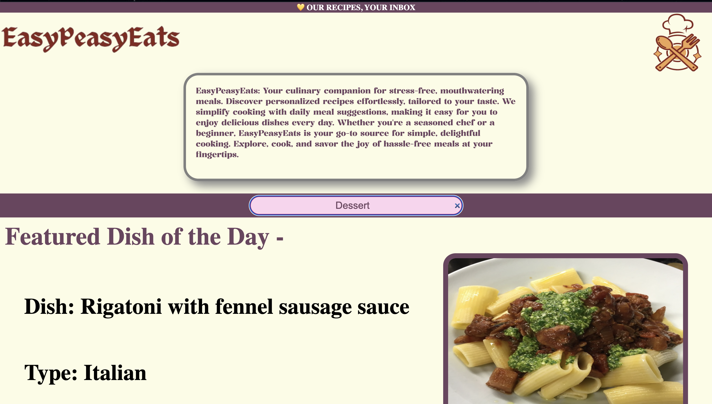
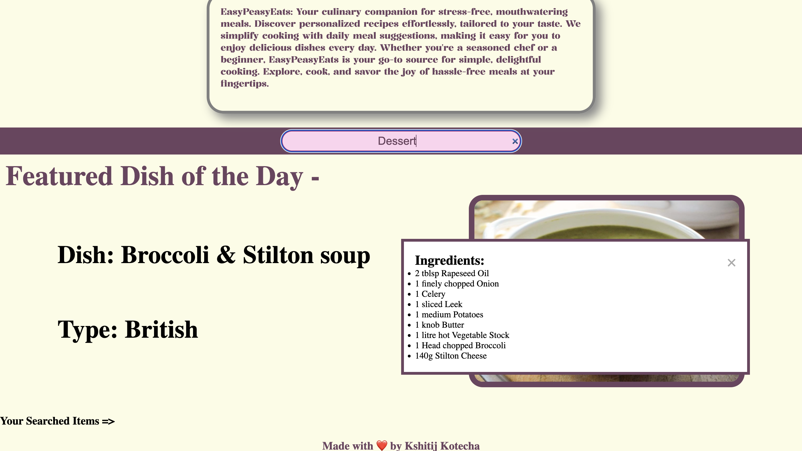

# EasyPeasyEats

Welcome to EasyPeasyEats - Vsit this Website for hassle-free and delicious recipes! Whether you're a seasoned chef or a kitchen novice. Explore a wide range of recipes, organized by categories, to suit your taste and preferences.

### Prerequisites

Make sure you have the following installed before you start:
- Web browser (Chrome, Firefox, Safari, etcetra.)

### Installation

No installation is required for EasyPeasyEats. You can simply visit our website at [https://kshitij162005.github.io/CA3_Fewd/] and start exploring mouthwatering recipes right away.

## Features

- **User-Friendly Interface**: Navigate through our website with ease, thanks to our intuitive and user-friendly design.

- **Search by Category**: Find recipes based on your preferences by exploring categories such as breakfast, lunch, dinner, desserts, and more.

- **Responsive Design**: Enjoy EasyPeasyEats on any device, whether it's a computer or a smartphone.

## Usage

1. **Visit the Website**: Open your preferred web browser and go to [www.easypeasyeats.com]

2. **Explore Categories**: Browse through the different recipe categories to find inspiration for your next meal.

3. **Search Functionality**: Use the search bar to find the specific ctegory of the meal like "dessert", "Vegan", "Chicken" etcetra.

## Support

For any issues or questions, feel free to [contact Kshitij(developer of this website)](mailto:kshitij.kotecha@kalvium.community).

## Copyright

This project is copyrighted under the  ©GroGames@23

Happy Cooking! 🍽️👩‍🍳👨‍🍳

**Some Visuals of the Website --**

